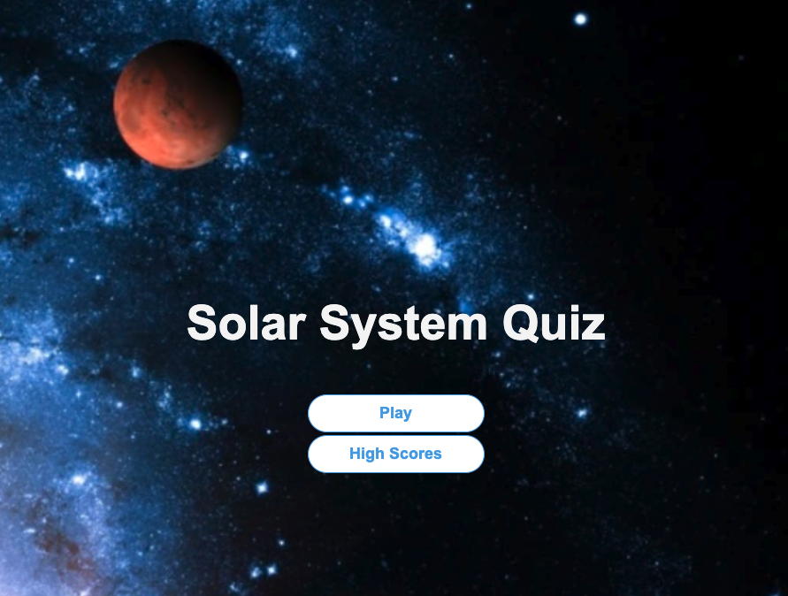

# 04-Coding-Quiz
 ## Table of Contents

- [Description](#description)
- [Usage](#usage)
- [Credits and References](#credits-and-references)
- [Badges](#badges)

## Description

Assignment: 04-Quiz Challenge

Task:

- 1. Click button to start the quiz game.
- 2. Create questions and timer. 
- 3. As questions are answered, it scrolls to the next question.
- 4. Subtract time when there's an incorrect answer.
- 5. Quiz ends when all questions are answered or timer reaches 0.
- 6. Be able to enter name
- 7. Be able to save score to local storage.
- 8. Be able to sort and render highscores from local storage.
- Create acceptable ReadMe file.
- Concise, descriptive title.

Lessons Learned:
- Completed all of the above tasks
- Discovered there are multiple ways of accomplishing the same result.
- Understood how to create and apply code for the timer.
- Understood how to use open sources to assist in developing codes.
- Improved understanding of git functions and processes.
- Understood how to request tutor for assistance.
- Deployed the application (See Usage)
- Repo has a unique name

## Usage

Launch live site at [https://vinniewaan.github.io/04-Solar-System-Quiz/](https://vinniewaan.github.io/04-Solar-System-Quiz/) 

## Credits and References

[Vinnie Waan](https://github.com/VinnieWaan/)

[Learn {to} Code (YouTube Tutorial)](https://www.youtube.com/watch?v=icb9AUBeznQ)

[PRAROZ (YouTube Tutorial)](https://www.youtube.com/watch?v=1ydfKDwsYbU)

[Brian Design (YouTube Tutorial)](https://www.youtube.com/watch?v=f4fB9Xg2JEY)

## Badges

